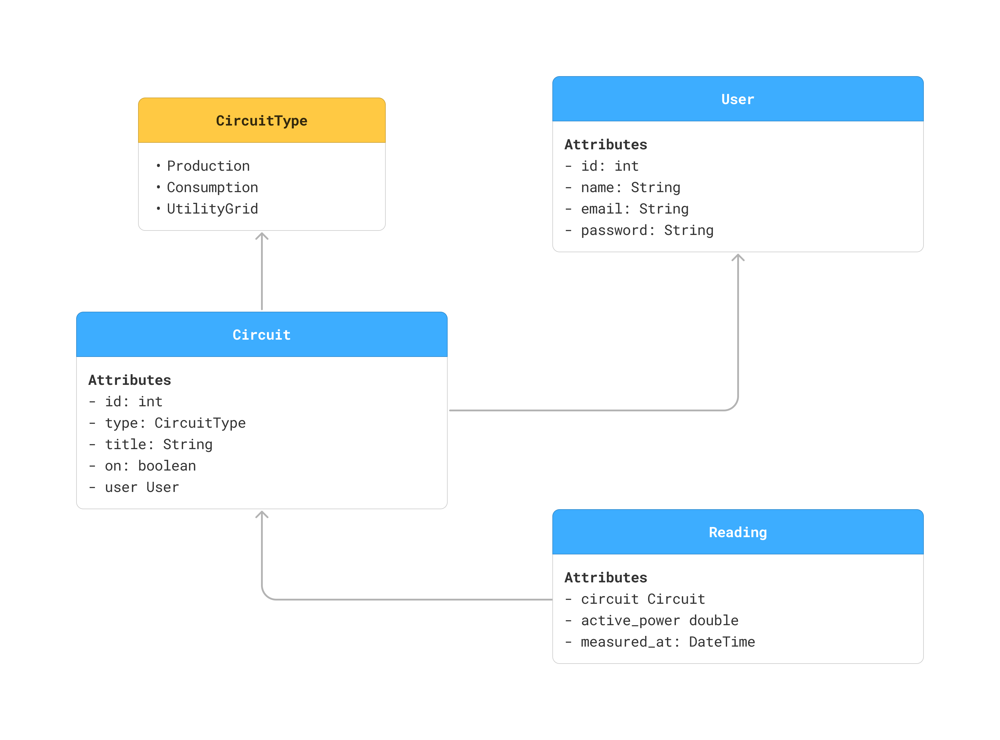
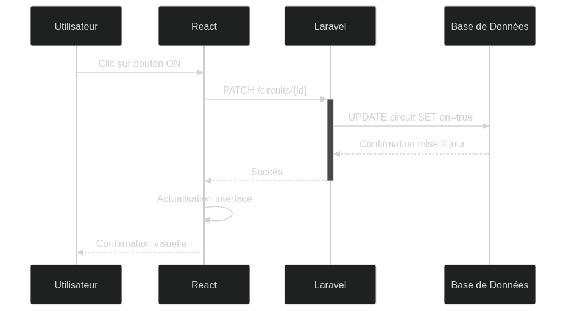
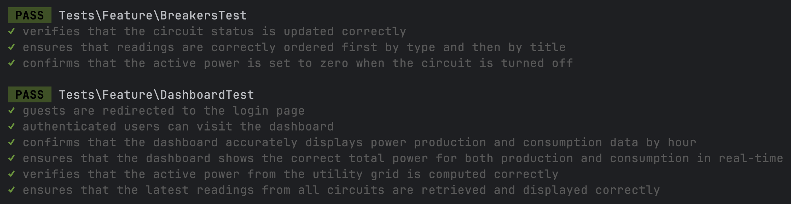

# Slide 1

## Introduction

The development of solar energy creates a need for solutions to better manage energy production and consumption.

# Slide 2

## Problem Statement

- Limited visibility of solar panel performance
- Energy wastage due to lack of real-time consumption tracking
- Manual control of circuits with no remote management
- Maintenance difficulties due to lack of centralized monitoring

# Slide 3

## Project Objectives

- Real-time tracking of solar panel performance.
- Identifying energy-intensive devices.
- Remote control of circuits.
- User-friendly interface accessible to non-technical users.

## Technology Stack

# Slide 4

- Laravel
- React
- Inertia
- PostgreSQL

# Slide 5

## Data Model

## Sequence Diagram

## Unit and Integration testing

## Demonstration

## Conclusion

This project led to the creation of an application to monitor and control energy in real-time, while promoting comfort and savings.
